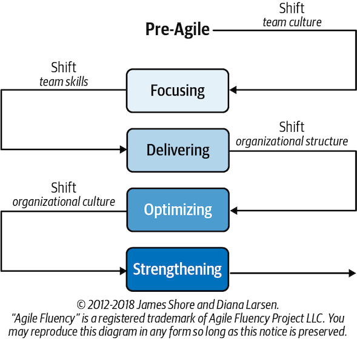

# Intro to Agile

- [Intro to Agile](#intro-to-agile)
  - [History](#history)
  - [Agile](#agile)
  - [Scrum](#scrum)

## History 
- Software crisis in 1970–90s — software was not being delivered (or not on time), over budget, unreliable, & hard to maintain
- This led to development of Waterfall, as people came up with simpler, slimmer, less prescriptive methods for software development
  - **Waterfall**: strict linear, sequential approach

## Agile 
- Came out of Waterfall
- Has lots of methodologies, e.g. TDD (test-driven development), FDD (feature-driven development), Lean, Kanban, Scrum
- Philosophy:
  - Agile doesn't naturally involve a deadline, but it can work to them via **forecasting** — reducing scope (i.e. supplementary features/non-critical functionality) to suit a date
  - **Individuals & interactions** more important than processes and tools when it comes down to it
  - Getting **working software** more important than comprehensive/immediate documentation
  - **Customer collaboration** more important than contract negotiation
  - **Responding/adapting to change** more important than following a plan and being prescriptive
  - Has 12 principles — most relevant to devops are **continuous delivery, delivering working software frequently to end users, and reflecting at regular intervals**
  - Involves people with business, dev, ops, and engineering expertise working together to create a product
  - Should help focus and productivity
  - If Agile teams are used by an org, it's likely DevOps engineers will be on a "development team"
- Agile **might not always be best** for a company depending on their existing culture and how willing they are to adapt to it
- As teams become more Agile, DevOps is more needed
- Stages of Agile fluency model:
  - **Focusing**: shifting team culture
  - **Delivering**: shifting team skills; this is where DevOps becomes essential
  - **Optimising**: shifting organisational structure
  - **Strengthening**: shifting organisational culture

- Not all orgs that say they're Agile are; they may be a **cargo cult**:
  - This is when something looks like Agile because an org has adopted some outward signs
  - But it isn't because they aren't really people-centric and ignore elements (e.g. adaptive planning or planning being less important) that are uncomfortable to their current culture

## Scrum
  - A methodolgy using Agile principles
  - Involves daily **stand-ups**: short meetings with standard questions e.g. about what you did yday, what you'll do today, & any blockers you have
  - Involves **sprints**:
    -  these pull in tasks from the backlog to complete (known as **user stories** — informal, general explanation of a software feature written from the perspective of the end user) to complete
    - standard length of **2 weeks**
    - team then **reviews** what they actually achieved and what needs to go back into backlog
    - finally, team conducts a retrospective (**retro**) of what went well and what needs to be improved
  - Tasks are prioritised by what will add **most business value**
  - Good for projects that will likely feature trial and error or where things are changing rapidly
  - Even though software still gets in late & over budget, Agile helps the software crisis because it **shows progress with working software** and is therefore more likely to meet requirements
