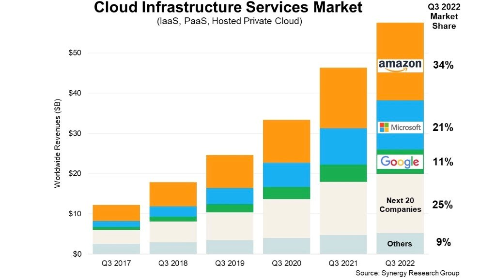

# Cloud notes

> ## [For Sparta: see important rules about use](https://teams.microsoft.com/l/entity/com.microsoft.teamspace.tab.planner/tt.c_19:TrpQwMO1PhqN7mR8x3SAhj2rcRGRLydw29ZVM26z2m01@thread.tacv2_p_rzzvyNukM0GzIMpb8EjAVJYAD4Ih_h_1736761296374?tenantId=ff15c67c-2870-4e9f-adc1-7d61d855b667&webUrl=https%3A%2F%2Ftasks.teams.microsoft.com%2Fteamsui%2FpersonalApp%2Falltasklists&context=%7B%22subEntityId%22%3A%22%2Fv1%2Fplan%2FrzzvyNukM0GzIMpb8EjAVJYAD4Ih%2Ftask%2FiqUxoyhSfUu-MTXos5X1yZYAA60s%22%2C%22channelId%22%3A%2219%3ATrpQwMO1PhqN7mR8x3SAhj2rcRGRLydw29ZVM26z2m01%40thread.tacv2%22%7D)

- [Cloud notes](#cloud-notes)
    - [What is the cloud?](#what-is-the-cloud)
    - [Levels of service](#levels-of-service)
  - [Cloud providers](#cloud-providers)
  - [Resources that can be hosted in the cloud](#resources-that-can-be-hosted-in-the-cloud)
  - [SSH key-pairs](#ssh-key-pairs)
- [Creating resources in Azure](#creating-resources-in-azure)
  - [Logging in and out of the VM](#logging-in-and-out-of-the-vm)
  - [General Azure instructions](#general-azure-instructions)
  - [Relevant Git commands](#relevant-git-commands)

### What is the cloud?

- Broadly speaking, a pay-as-you-go service available over the Internet (though not private cloud)
- Advantages:
  - Offers scalable capacity to create resources 
  - Everything is centrally managed and accessed
  - More secure
  - Improved collaboration
  - for start-ups and small businesses, the cloud offers tools that they wouldn't otherwise have access to on-prem
- Disadvantages:
  - Depends on Internet
  - Possibly requires staff upskilling/culture shift 
- Cloud is hosted by cloud providers
- Differences between on-prem and the cloud? 
  - On-premise resources are hosted on hardware you own/rent, whereas cloud resources are hosted by a provider
  - You have less control and thus less responsibility over resources in the cloud (to varying extents depending on level of service)
- OpEx vs. CapEx:
  - the initial investment costs for migrating to the cloud vs. the day-to-day costs in running it
  - CapEx is typically lower with cloud than on-prem whereas OpEx is higher with cloud, though it's still pay-as-you-go
  - companies may choose to pay upfront (OpEx) on some things because it offers them a discount
- Is migrating to the cloud always cheaper?:
  - No but depends on the business and what they would use in the cloud (also staff) vs. what they have on-prem (also utilities) e.g. can be calculated using Azure's Total Cost of Ownership calculator
  - for many businesses, being on-prem is cheaper
  - Higher cloud costs can be balanced with viewing it as an investment in some cases, e.g. compliance
- What are the 4 pillars of DevOps? How do they link into the Cloud?:
  - Continuous Integration (CI)
  - Continuous Delivery (CD)
  - Infrastructure as Code (IaC)
  - Monitoring and Logging 
  - **all use the cloud to execute tasks or generally to maintain connections with machine to perform them**
- Models:
  - Private: one org only; more secure; full control over infrastructure
  - Public: managed service providers manage the cloud for you, so less control/responsibility
  - Hybrid: prioritised use of private and public
  - Multi-cloud: using multiple cloud service providers for more reliability (this approach to backup services is known as **redundancy** and it's a good thing)

### Levels of service 

-   Depending on the cloud service, you have a **different level of control** (and thus **responsibility**) over security (also different costs)
-   So cloud isn't necessarily safer than on-premises --- it depends on the level of service you choose
-   Options:
    -   **IaaS**: raw IT resources; offers wide scope of scalability; almost entirely **customisable**; e.g. AWS
    -   **PaaS**: platform that gives devs an environment to deploy code; step down from infrastructure; e.g. SAP
    -   **SaaS**: lowest level of service; most popular service because of its simplicity, e.g. Zoom, Salesforce

-   **Middleware**: the extra things that need to be installed/configured (e.g. packages or libraries) to communicate between your code and OS

-   **Runtime**: software/instructions executed while a programme is running

## Cloud providers

-   AWS has biggest market-share; then Azure, then GCP

-   Azure is helped by being Microsoft-owned, so it seamlessly integrates with that ecosystem, e.g. Microsoft 365 users just need permissions adding to Azure

-   Harder to find GCP talent so salaries can be higher
   
   

## Resources that can be hosted in the cloud

-   **Compute** resources:

    -   Virtual machines

-   **Network** resources:

    -   Virtual networks (e.g. Azure's VPC)

-   **Databases**

-   **Object storage**, e.g. AWS S3 or Azure Blob Storage

 

## SSH key-pairs

-  You connect to a remote machine/the cloud etc. using an **SSH key-pair**, which, once created, is found in ***.ssh*** sub-directory in the local machine's home directory
-  This contains a **public and private key**, which are used as secure access credentials when 
-  The public SSH key is shared with a server you want to access
-  The private key is always kept private and secure
-  to "ssh into" a machine essentially means to log into it
-  To create an SSH key-pair:
   -  ***ssh-keygen <parameters>*** — this creates a private and public key pair (1 of each; private needs to be kept private) — note that when setting keypair names, don't use backspace as this will introduce weird characters into the name

# Creating resources in Azure

-   When creating a resource, it's good practice to end it with the resource name e.g. "farah-vnet"

-   Virtual machines in public subnets **CAN** have a public IP address via its NIC card if you want to communicate from outside the v-net; as well as a private IP address for communication within the virtual network

-   When doing something architecturally on the cloud, plan it out first

-   Virtual machines need to live in a **subnet** on a virtual network
-   **Our vnet:**
> -   **Name**: tech501-farah-2-subnet-vnet
>-   **Region**: UK South
>-   **Space**: CIDR
> - **IP**: 10.0.0.1/16 = 65k+ IP addresses
>-   These are in IPv4
>-   This will be split into public-subnet and a private-subnet
>-   **public-subnet**: private IP address within 10.0.2.0/24 = 256 subnets; probably 1 VM in here for week 1
>-   **private-subnet**: private IP address within 10.0.3.0/24; probably 1 VM in here for week 1

-   **Our Week 1 virtual machine** (note that this can take a couple of minutes to deploy once created):
> -   **Name**: tech501-farah-first-vm
>-   **Region**: UK South
>-   **Security**: standard
>-   **Image** (i.e. the OS that will go onto the machine): Ubuntu Pro 18.04 LTS Gen 2 [LTS means long term support for ~7 years]
>-   **Size**: Standard_B1s --- 1 vcpu, 1 GiB [very important to set correctly because this impacts pricing]
>-   **Administrator account**: adminuser
>-   Use existing key pair stored in Azure (use the one with your name)
>-   **Select inbound ports**: allow HTTP and SSH traffic
>-   **Disks** tab:
 >     -   OS disk type: Standard SSD
 > - **Networking** tab:
>   - **Virtual network**: your named version
>   - **Subnet**: public-subnet
>   - Enable ***Delete public IP and NIC when VM is deleted*** option
 > -   **Tags:**
 >      - Owner, Farah
-   Note that VMs run as soon as they are successfully created so **need stopping from resource page before breaks**
-   -   To delete VM, delete all resources that begin with "*tech501-farah-first-vm-*" from resource group

## Logging in and out of the VM

-   To log in and out of a VM on Azure:

    -   Start (maybe wait 30 seconds)

    -   Connect via native SSH

    -   Paste ssh key name in

    -   Copy resulting modified output

    -   Ensuring you're in the .ssh folder in git bash, paste this into git bash and submit --- now logged in! (note that on first login, you will need to confirm with *yes*)

    -   Use ***exit*** command to log out

## General Azure instructions

-   Be sure to add tags when creating a resource (per Teams notes: **Name**: Owner, **Value**: Farah)

-   To delete, can either go into the resource and press Delete on toolbar, or to delete multiple resources, go to resource group, tick them, and press three dots in top right and delete (need to confirm with keyboard)
-   When uploading an existing SSH key to Azure, best practice is to give it the same name as it has on local machine for easier matching (can ignore *.pub)
    -   Ensure that you upload the **public key**, not the private — this can be verified by checking last line doesn't notify us that it's private
Azure's API (interface manager) is **ARM**

## Relevant Git commands

-   ***ssh-keygen \<parameters>*** --- this creates a private and public key pair (1 of each; private one needs to be kept private)
    -   note that when setting keypair names, **don't backspace** as this will introduce weird characters into the name
